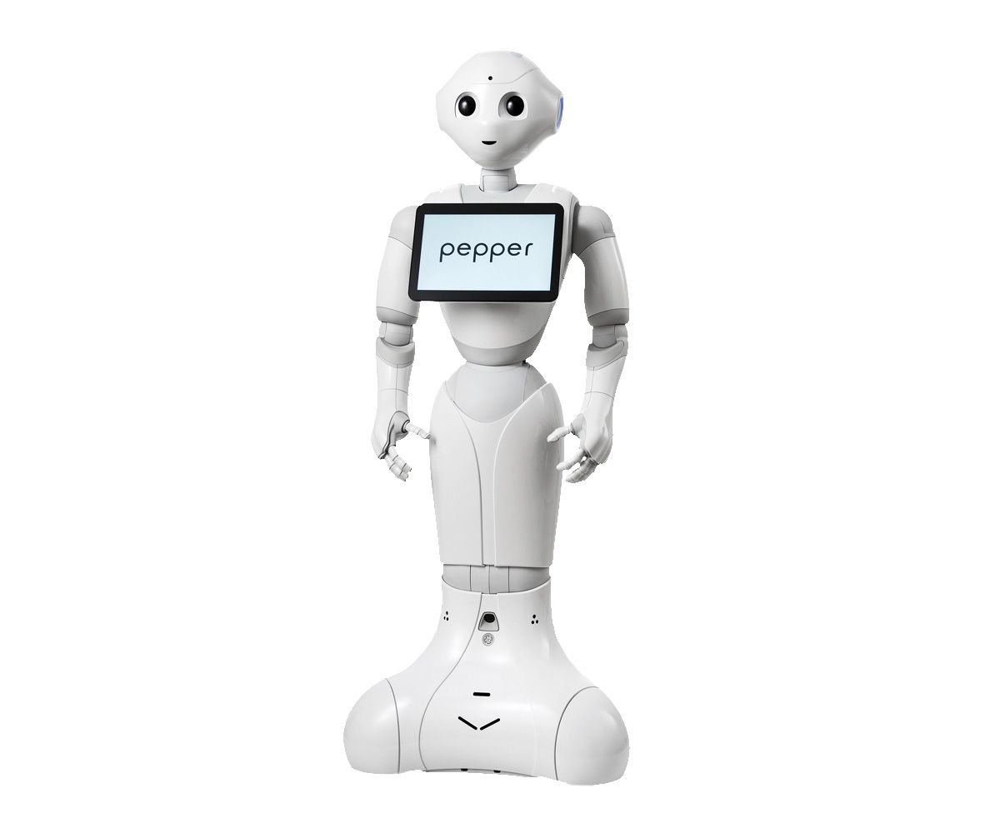

# Pepper Medical Assistance Robot

> **AAST Graduation Project** — An intelligent humanoid hospital receptionist powered by SoftBank's Pepper robot, combining voice AI, face recognition, multilingual interaction, and autonomous navigation for Andalusia Hospital.

---

## Table of Contents

- [Overview](#overview)
- [System Architecture](#system-architecture)
- [Features](#features)
- [Technology Stack](#technology-stack)
- [Prerequisites](#prerequisites)
- [Installation](#installation)
- [Configuration](#configuration)
- [Running the Project](#running-the-project)
- [Project Structure](#project-structure)
- [API Reference](#api-reference)
- [Offline Mode](#offline-mode)
- [Team](#team)

---

## Overview

Pepper Medical Assistance Robot transforms Pepper, a humanoid social robot, into a fully functional hospital receptionist for Andalusia Hospital. Patients interact naturally — by voice or touch — in **Arabic or English**, and Pepper responds intelligently, books appointments, guides navigation, detects emergencies, and personalizes every interaction using face recognition.

The system runs entirely on a local LAN connection between a Windows laptop (server) and the Pepper robot, with no cloud dependency when using offline mode.



---

## System Architecture

```
┌─────────────────────────────────────────────────────────────────┐
│                         WINDOWS LAPTOP                          │
│                                                                 │
│  ┌───────────────────────────────────────────────────────────┐  │
│  │              Flask Backend  (Python 3, port 8080)         │  │
│  │                                                           │  │
│  │  ┌─────────────┐  ┌──────────────┐  ┌─────────────────┐  │  │
│  │  │ Whisper STT │  │  Claude API  │  │  Ollama (local) │  │  │
│  │  │ (CTranslate)│  │  (online)    │  │  qwen2.5:7b     │  │  │
│  │  └─────────────┘  └──────────────┘  └─────────────────┘  │  │
│  │                                                           │  │
│  │  ┌─────────────┐  ┌──────────────┐  ┌─────────────────┐  │  │
│  │  │  FAISS RAG  │  │  Face Auth   │  │  Hospital DB    │  │  │
│  │  │  (hospital  │  │  (OpenCV)    │  │  (SQLite)       │  │  │
│  │  │   knowledge)│  └──────────────┘  └─────────────────┘  │  │
│  │  └─────────────┘                                         │  │
│  └───────────────────────────────────────────────────────────┘  │
│                              │                                  │
│  ┌──────────────────────┐    │    ┌──────────────────────────┐  │
│  │  WebSocket Bridge    │◄───┘    │  Camera Server           │  │
│  │  (port 8765)         │         │  (port 8082, Python 2.7) │  │
│  └──────────┬───────────┘         └──────────────────────────┘  │
└─────────────┼───────────────────────────────────────────────────┘
              │  LAN Cable (192.168.x.x)
┌─────────────┼───────────────────────────────────────────────────┐
│             │         PEPPER ROBOT (NAOqi 2.8)                  │
│  ┌──────────▼───────────┐  ┌──────────────────────────────────┐ │
│  │  NAOqi WebSocket     │  │  Tablet Browser                  │ │
│  │  (MainVoice.py)      │  │  → Flask server UI               │ │
│  │  (nav_bridge.py)     │  │  → Arabic/English touch UI       │ │
│  └──────────────────────┘  └──────────────────────────────────┘ │
└─────────────────────────────────────────────────────────────────┘
```

---

## Features

### Patient-Facing Capabilities
- **Voice Interaction** — Speak to Pepper in Arabic or English; Whisper STT transcribes in real time (~0.9s latency)
- **AI Conversation** — Intelligent responses via Claude API (online) or Ollama/qwen2.5:7b (offline), with full agentic tool calling
- **Appointment Booking** — Book, view, and cancel doctor appointments by voice or touch
- **Hospital Navigation** — Pepper physically guides patients to departments and wards
- **Face Recognition Login** — Patients are recognized by face on arrival; no typing needed
- **Emergency Detection** — Automatic triage and alerts for urgent conditions
- **Health Tips** — Context-aware wellness suggestions in the patient's language
- **Symptom Checker** — Basic symptom-to-department routing with urgency scoring
- **Doctor Schedules** — Real-time availability lookup for all Andalusia Hospital departments

### Technical Capabilities
- **Bilingual UI** — Full Arabic/English tablet interface with RTL support
- **RAG Knowledge Base** — FAISS-indexed Andalusia Hospital corpus for accurate, grounded answers
- **Sentiment Analysis** — Detects patient stress or urgency and adjusts response tone
- **Emotion Detection** — OpenCV-based expression reading from tablet camera
- **Medical NER** — Extracts symptoms, medications, and body parts from free-text
- **Conversation Memory** — Per-session context retention across multi-turn dialogue
- **Offline Mode** — Full functionality without internet using local Ollama LLM
- **QR Check-in** — Fast check-in via QR code scan on the tablet

---

## Technology Stack

| Layer | Technology |
|---|---|
| Robot Platform | SoftBank Pepper (NAOqi 2.8, Python 2.7) |
| Backend Server | Python 3.13, Flask 3, SQLAlchemy |
| Speech-to-Text | faster-whisper (CTranslate2, int8 quantized) |
| AI — Online | Anthropic Claude API (claude-haiku-4-5) |
| AI — Offline | Ollama + qwen2.5:7b (native tool calling) |
| Knowledge Base | FAISS + sentence-transformers RAG |
| Face Recognition | OpenCV LBPH face recognizer |
| Database | SQLite (appointments, patients, doctors) |
| Real-time Bridge | WebSocket (asyncio, port 8765) |
| Robot Camera | HTTP MJPEG stream (port 8082) |
| Tablet UI | HTML5/CSS3/Vanilla JS (touch-optimized) |
| Networking | LAN Ethernet (robot ↔ laptop) |

---

## Prerequisites

### Hardware
- SoftBank Pepper robot (NAOqi 2.8.x firmware)
- Windows 10/11 laptop connected to Pepper via LAN cable
- Static IP assigned: laptop `1.1.1.249`, robot `1.1.1.10` (configurable)

### Software — Windows Laptop
- **Python 3.10+** (tested on 3.13)
- **Python 2.7** (for NAOqi SDK scripts — robot-side only)
- **NAOqi Python 2.7 SDK** (`pynaoqi-python2.7-2.8.x-win64`)
  - Extract to `C:\pynaoqi\` and update path in `main.py`
- **Ollama** (optional, for offline mode) — [ollama.com](https://ollama.com)

---

## Installation

### 1. Clone the repository

```bash
git clone https://github.com/AlyLotfy/Pepper-Medical-Assistance-Robot.git
cd Pepper-Medical-Assistance-Robot
```

### 2. Create and activate a Python 3 virtual environment

```bash
python -m venv pepper_env
pepper_env\Scripts\activate      # Windows
```

### 3. Install Python 3 dependencies

```bash
pip install -r requirements.txt
```

### 4. Set up your Anthropic API key (online mode)

Create a `.env` file in the project root:

```
ANTHROPIC_API_KEY=your_api_key_here
```

Or set it as a system environment variable.

### 5. Initialize the hospital database

The hospital SQLite database (`hospital.db`) is auto-created on first run from the CSV/Excel data files in `Pepper-Controller-main-2/pepper_ui/server/app/Data/`.

### 6. Build the RAG index (first-time only)

```bash
cd Pepper-Controller-main-2/pepper_ui/server/app
python rag_engine.py
```

This creates `rag_index.faiss` and `rag_meta.json` from `rag_corpus.json`.

### 7. (Offline only) Pull the Ollama model

```bash
ollama pull qwen2.5:7b
```

---

## Configuration

Copy the example config and fill in your network addresses:

```bash
cp config.example.json config.json
```

```json
{
    "ROBOT_IP": "1.1.1.10",
    "ROBOT_PORT": 9559,
    "SERVER_IP": "1.1.1.249",
    "SERVER_PORT": 8080,
    "WS_PORT": 8765
}
```

| Field | Description |
|---|---|
| `ROBOT_IP` | Pepper robot's static LAN IP |
| `ROBOT_PORT` | NAOqi broker port (always 9559) |
| `SERVER_IP` | Laptop's LAN IP (what the tablet browser connects to) |
| `SERVER_PORT` | Flask server port |
| `WS_PORT` | WebSocket bridge port |

---

## Running the Project

### Standard Mode (online, Claude API)

```bash
python main.py
```

### Offline Mode (local Ollama LLM, no internet required)

```bash
# In a separate terminal, start Ollama first:
ollama serve

# Then launch the project:
python main.py --offline
```

### Server Only (no robot hardware — for development)

```bash
python main.py --server-only
```

The tablet UI is accessible at `http://<SERVER_IP>:<SERVER_PORT>` from any browser on the same network.

### What `main.py` starts

| Process | Runtime | Purpose |
|---|---|---|
| Flask backend (`app.py`) | Python 3 | REST API, AI chat, DB, RAG |
| WebSocket bridge (`ws_bridge.py`) | Python 3 | Real-time robot↔server messaging |
| Voice module (`MainVoice.py`) | Python 2.7 + NAOqi | Pepper microphone capture & TTS |
| Navigation bridge (`nav_bridge.py`) | Python 2.7 + NAOqi | Autonomous robot navigation |
| Camera server (`camera_server.py`) | Python 2.7 + NAOqi | Live camera feed to tablet |
| Tablet loader (`show_tablet.py`) | Python 2.7 + NAOqi | Opens UI on Pepper's tablet screen |

---

## Project Structure

```
Pepper-Medical-Assistance-Robot/
│
├── main.py                          # Master launcher — starts all subsystems
├── config.json                      # Network config (gitignored — use config.example.json)
├── config.example.json              # Template for config.json
├── requirements.txt                 # Python 3 dependencies
├── load_config.py                   # Config loader helper
├── generate_report.py               # Appointment report generator
│
├── Pepper-Controller-main-2/
│   │
│   ├── pepper_ui/
│   │   ├── robot/
│   │   │   ├── show_tablet.py       # Loads web UI onto Pepper's tablet (Py2)
│   │   │   ├── camera_server.py     # HTTP camera stream server (Py2, port 8082)
│   │   │   ├── camera_stream.py     # NAOqi camera capture helper
│   │   │   ├── bridge.py            # Robot WebSocket client
│   │   │   └── ui_bridge.py         # UI event bridge
│   │   │
│   │   └── server/
│   │       ├── app/
│   │       │   ├── app.py           # Flask server — all REST endpoints (1600+ lines)
│   │       │   ├── rag_engine.py    # FAISS RAG retrieval engine
│   │       │   ├── emotion_detector.py  # OpenCV emotion detection
│   │       │   ├── rag_corpus.json  # Andalusia Hospital knowledge base
│   │       │   ├── Branches.csv     # Hospital branches data
│   │       │   ├── Doctors.csv      # Doctor roster
│   │       │   ├── Departments.csv  # Department list
│   │       │   ├── Data/            # Source Excel files for DB population
│   │       │   └── ai_modules/
│   │       │       ├── conversation_memory.py  # Per-session chat history
│   │       │       ├── face_auth.py             # OpenCV face recognition
│   │       │       ├── medical_ner.py           # Medical entity extraction
│   │       │       ├── sentiment.py             # Patient sentiment analysis
│   │       │       └── symptom_checker.py       # Symptom-to-department routing
│   │       │
│   │       └── static/              # Tablet web UI (HTML/CSS/JS)
│   │           ├── index.html       # Home page — patient portal tiles
│   │           ├── chat.html        # Voice/text AI chat interface
│   │           ├── book.html        # Appointment booking
│   │           ├── appointments.html  # View/cancel appointments
│   │           ├── face_login.html  # Face recognition login
│   │           ├── face_enroll.html # New patient face enrollment
│   │           ├── login.html       # Username/password login
│   │           ├── signup.html      # New patient registration
│   │           ├── emergency.html   # Emergency alert page
│   │           ├── triage.html      # Symptom triage form
│   │           ├── schedule.html    # Doctor schedule viewer
│   │           ├── guide.html       # Hospital directory
│   │           ├── about.html       # About Pepper
│   │           ├── tips.html        # Health tips
│   │           ├── staff_dashboard.html  # Staff admin panel
│   │           ├── qr_checkin.html  # QR code check-in
│   │           ├── i18n.js          # Arabic/English translations
│   │           └── style.css        # Tablet-optimized CSS
│   │
│   ├── pepper_voice/
│   │   ├── MainVoice.py             # NAOqi voice capture loop + TTS (Py2)
│   │   ├── ws_bridge.py             # WebSocket server for voice ↔ robot commands (Py3)
│   │   └── pepper_voice.py          # NAOqi TTS helper
│   │
│   └── navigation/
│       ├── nav_bridge.py            # Navigation WebSocket client (Py2, NAOqi)
│       ├── nav_manager.py           # Navigation target manager
│       ├── map_exploration.py       # Autonomous map learning
│       └── navigation_targets.json  # Named locations in the hospital
│
└── Documents/                       # Project documentation & reports
    ├── Pepper_Medical_Assistance.pdf
    ├── Technical Report.pdf
    ├── Pepper Pipeline.pdf
    └── ...
```

---

## API Reference

All endpoints are served by the Flask backend on `http://<SERVER_IP>:<SERVER_PORT>`.

### Voice & Chat

| Method | Endpoint | Description |
|---|---|---|
| `POST` | `/voice` | Submit audio file → returns AI text + TTS audio |
| `POST` | `/chat` | Submit text message → returns AI response |
| `GET` | `/language` | Get current UI language (`ar`/`en`) |
| `POST` | `/language` | Set UI language |

### Appointments

| Method | Endpoint | Description |
|---|---|---|
| `GET` | `/api/doctors` | List all doctors with availability |
| `GET` | `/api/departments` | List all departments |
| `POST` | `/api/book` | Book an appointment |
| `GET` | `/api/appointments/<patient_id>` | Get patient appointments |
| `DELETE` | `/api/appointments/<id>` | Cancel an appointment |

### Authentication

| Method | Endpoint | Description |
|---|---|---|
| `POST` | `/api/login` | Username/password login |
| `POST` | `/api/signup` | New patient registration |
| `POST` | `/api/face/enroll` | Enroll face for a patient |
| `POST` | `/api/face/login` | Authenticate via face recognition |

### Navigation

| Method | Endpoint | Description |
|---|---|---|
| `POST` | `/api/navigate` | Send navigation command to Pepper |
| `GET` | `/api/nav/targets` | List all named navigation targets |

### Utilities

| Method | Endpoint | Description |
|---|---|---|
| `GET` | `/api/camera` | Latest JPEG frame from Pepper's camera |
| `POST` | `/api/emergency` | Trigger emergency alert |
| `GET` | `/api/health_tips` | Get contextual health tips |
| `POST` | `/api/triage` | Symptom triage scoring |

---

## Offline Mode

When started with `python main.py --offline`, the system:

1. Replaces Claude API calls with **Ollama + qwen2.5:7b** running locally
2. Uses the same tool-calling agentic loop (native Ollama tools format)
3. All features work identically — booking, navigation, lookup — no internet required
4. Whisper STT continues to run locally (always was local)
5. RAG knowledge retrieval is unaffected (always local FAISS)

**Requirements for offline mode:**
- Ollama installed and running (`ollama serve`)
- `qwen2.5:7b` model pulled (`ollama pull qwen2.5:7b`)
- ~5GB disk space for the model

---

## Team

**Arab Academy for Science, Technology & Maritime Transport (AAST)**
Computer Engineering Department — Graduation Project 2025/2026

| Name | Role |
|---|---|
| Aly Lotfy | Backend AI, Flask Server, Offline Mode |
| [Team Member] | Navigation & Robot Control |
| [Team Member] | Frontend UI & Tablet Interface |
| [Team Member] | Face Recognition & Computer Vision |

**Supervisor:** [Supervisor Name], AAST

---

## License

This project was developed for academic purposes at AAST in partnership with Andalusia Hospital Group. All rights reserved.
